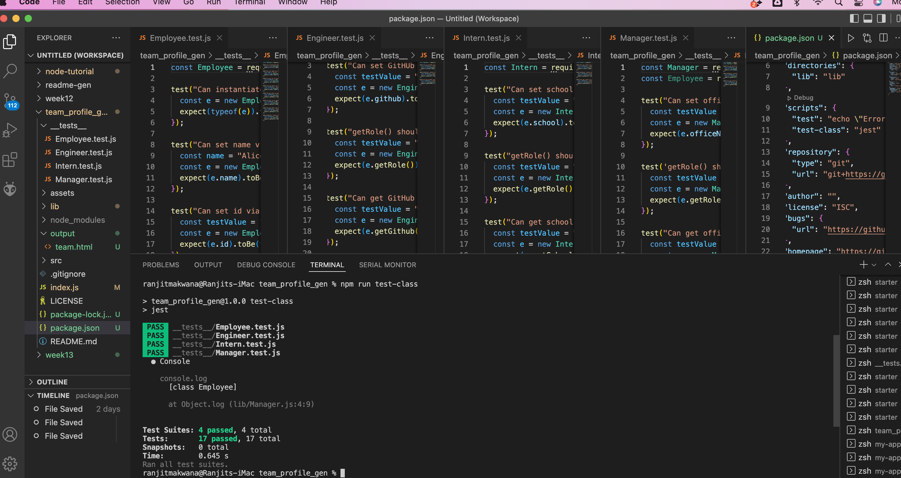
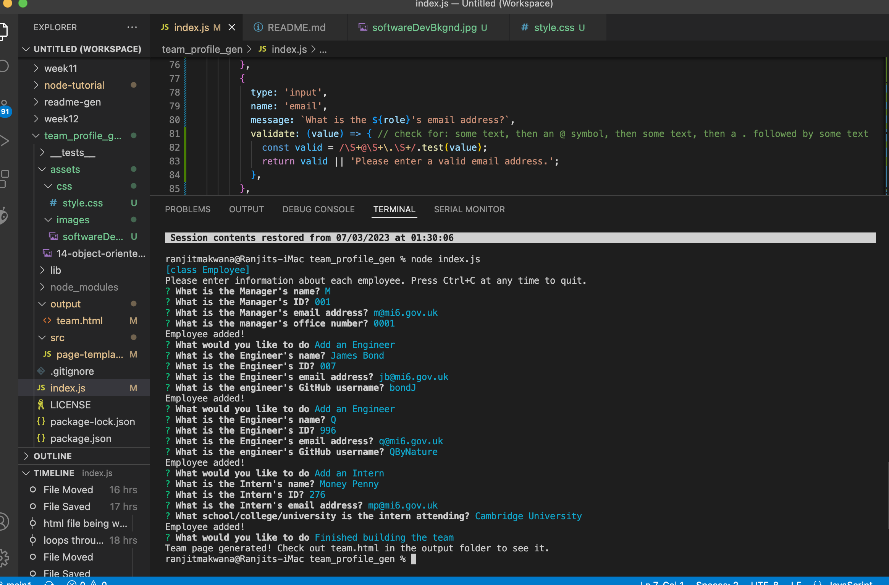
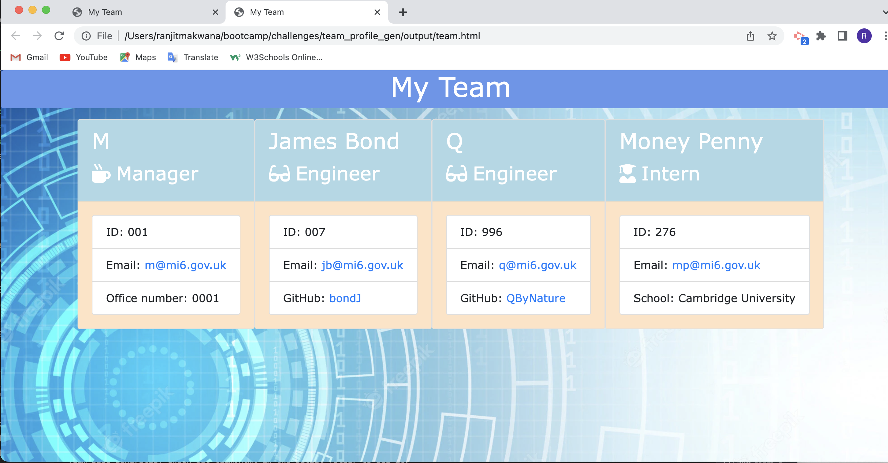

# Team Profile Generator

## Table of Contents
[Requirement](#requirement)

[User Story](#userstory)

[Instructions](#instructions)

[Links](#links)

[Screenshots](#screenshots)

[Contributions](#contributions)

[Tests](#tests)

[Questions](#questions)

[License](#license)

## Requirement

An assignment as part of a Bootcamp course on frontend web development. Given the starter code, convert it into a working Node.js command-line application. This application will take in information about employees on a software engineering team, then generates an HTML webpage that displays summaries for each person. Tests have been provided for all the employee classes, so we need to ensure that the code passes each provided test.

## User_Story

As a manager a user want to generate a webpage that displays their team's basic info so that the user can have quick access to their emails and GitHub profiles.

## Instructions

* Create a command-line application that accepts accepts user input using the provided starter code.   
  * Create classes for each team member provided and export them. The tests for these classes (in the `_tests_` directory) must ALL pass.     
    * The first class is an `Employee` parent class with the following properties and methods:       
      * `name`
      * `id`
      * `email`
      * `getName()`
      * `getId()`
      * `getEmail()`
      * `getRole()`&mdash;returns `'Employee'`     
    * The other three classes will extend `Employee`.      
    * In addition to `Employee`'s properties and methods, `Manager` will also have the following:
      * `officeNumber`
      * `getRole()`&mdash;overridden to return `'Manager'`
    * In addition to `Employee`'s properties and methods, `Engineer` will also have the following:
      * `github`&mdash;GitHub username
      * `getGithub()`
      * `getRole()`&mdash;overridden to return `'Engineer'`
    * In addition to `Employee`'s properties and methods, `Intern` will also have the following:
      * `school`
      * `getSchool()`
      * `getRole()`&mdash;overridden to return `'Intern'`
    * Finally, although it’s not a requirement, consider adding validation to ensure that user input is in the proper format.   
  * Write code in `index.js` that uses inquirer to gather information about the development team members and creates objects for each team member using the correct classes as blueprints.
    * When a user starts the application then they are prompted to enter the **team manager**’s:
      * Name
      * Employee ID
      * Email address
      * Office number
    * When a user enters those requirements then the user is presented with a menu with the option to:
      * Add an engineer
      * Add an intern 
      * Finish building the team
    * When a user selects the **engineer** option then a user is prompted to enter the following and then the user is taken back to the menu:
      * Engineer's Name
      * ID
      * Email
      * GitHub username
    * When a user selects the intern option then a user is prompted to enter the following and then the user is taken back to the menu:
      * Intern’s name
      * ID
      * Email
      * School
    * When a user decides to finish building their team then they exit the application, and the HTML is generated.
  * Call the `render` function (provided for you) and pass in an array containing all employee objects; 
    * The `render` function will generate and return a block of HTML including templated divs for each employee!
  * Create an HTML file using the HTML returned from the `render` function. 
    * Write it to a file named `team.html` in the `output` folder. 
    * You can use the provided variable `outputPath` to target this location.

---

## Links

The files for this project can be found in this Github repo:
https://github.com/ranjmak/team_profile_gen

The sample team.html can be found in the output folder in this repo:
https://github.com/ranjmak/team_profile_gen/blob/main/output/team.html

## Screenshots

The following image shows Jest being run, which tests the functionality of the Employee, Manager, Engineer and Intern classes. It also shows the source code including the JSON package, indicating the CLI test to use when running the test:

---

The following image shows the user inputting details of their team:

---

The follwoing image shows the generated html file:

---

  ## Contributions
  If you would like to make a contribution to this project, please get in touch via email with your proposals

  ## Tests
  Jest was used to test the Employee, Manager, Engineer and Intern classes - the results are shown in the first screenshot above.

  ## Questions
  Please feel free to reach out to me with any questions about this project at [ranjit.makwana@gmail.com](mailto:ranjit.makwana@gmail.com). You can also check out my Github profile: [ranjmak](https://github.com/ranjmak).

  ---

  ## License
  This project is licensed under the terms of the  license:
  Unlicensed

2023 Ranj

Anyone is free to copy, modify, publish, use, compile, sell, or
distribute this software, either in source code form or as a compiled
binary, for any purpose, commercial or non-commercial, and by any
means.

THE SOFTWARE IS PROVIDED "AS IS", WITHOUT WARRANTY OF ANY KIND,
EXPRESS OR IMPLIED, INCLUDING BUT NOT LIMITED TO THE WARRANTIES OF
MERCHANTABILITY, FITNESS FOR A PARTICULAR PURPOSE AND NONINFRINGEMENT.
IN NO EVENT SHALL THE AUTHORS BE LIABLE FOR ANY CLAIM, DAMAGES OR
OTHER LIABILITY, WHETHER IN AN ACTION OF CONTRACT, TORT OR OTHERWISE,
ARISING FROM, OUT OF OR IN CONNECTION WITH THE SOFTWARE OR THE USE OR
OTHER DEALINGS IN THE SOFTWARE. See the Unlicenced license for more details.

